# OWASP- Web应用程序中的十大漏洞

原文鏈接：
[OWSAP TOP 10（2018）](https://www.greycampus.com/blog/information-security/owasp-top-vulnerabilities-in-web-applications)

##  介绍
OWASP（开放式Web应用程序安全项目）社区帮助组织开发安全的应用程序。他们提出了帮助组织和研究人员的标准，免费软件工具和会议。OWASP排名前10位的是前10个应用程序漏洞列表以及风险，影响和对策。该列表通常每3 - 4年刷新一次。

同样的问题将与一些例子一起讨论，这些例子将帮助崭露头角的笔友帮助理解应用程序中的这些漏洞并对其进行测试。开始吧！   

##  1.注入
##  介绍
“当用户能够输入不受信任的数据欺骗应用程序/系统执行非预期的命令时，就会发生注入攻击。”

注入可以是 - SQL查询，PHP查询，LDAP查询和OS命令。在我们跳到示例之前：让我们思考一些事情：

##  问：要注入什么？

答：查询，操作系统命令，代码和URL参数操作。

##  问：在哪里注入？

答：无论何时需要用户输入或使用都可以修改数据。它可以是文本框，用户名/密码字段，反馈字段，注释字段，URL等。

##  问：为什么要注入？

答：检查应用程序是否易受攻击。

例

下面是2个文本框 - 名字和姓氏。输入输入并单击GO后，输入将显示在屏幕上。

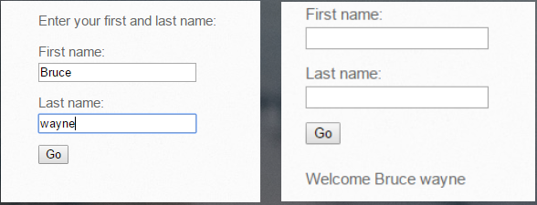

正常输入

现在让我们插入一些HTML标签，看看会发生什么。

处理HTML标记并显示输出。这可确保用户的输入尚未经过验证，并且仅假定受信任和处理。我们现在已经确定了一个HTML注入案例。类似地，可以测试PHP注入，OS命令注入，iFrame注入，LDAP注入等。

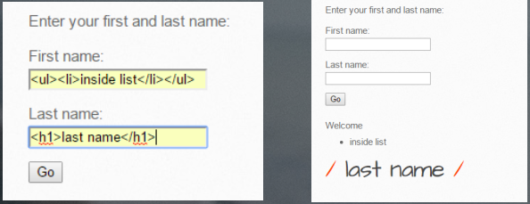

对策

+ 输入清理：在服务器端实施白名单方法，以便可以接受所有内容。

+ 使用安全的API和参数化查询。

2.认证失败
介绍
“当应用程序错误管理会话相关信息以致用户的身份受到损害时，就会出现身份验证损坏的情况。信息可以是会话cookie，密码，密钥等形式。“

这里的目的是要么进入其他人的会话，要么使用已经由用户结束的会话或窃取与会话相关的信息。我们来看看几个场景。 

例

注销后按后退按钮以查看是否可以进入上一个会话。

注销后尝试直接点击URL以检查您是否能够访问该页面。

检查URL中是否存在与会话相关的信息。尝试操纵它们来检查你是否能够骑别人的会话。

尝试在源代码中查找凭据。右键单击页面并点击查看源。有时编码员会对凭证进行硬编码，以便于访问，有时仍然无法识别。

 对策
+ 使用多因素身份验证

+ 会话隔离

+ 空闲会话超时

+ 使用安全的cookie

3.敏感数据暴露
介绍
“如果应用程序没有安全处理，攻击者可以嗅探或修改敏感数据。一些例子包括使用弱加密密钥，使用弱TLS。“

目标是识别敏感数据位并利用它们。

例

弱加密算法易受攻击并发出敏感数据。在下面的示例中，使用base64编码发送用户名和密码。 

 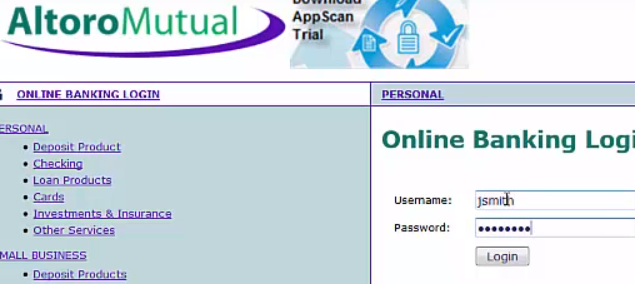

OWASP  - 敏感的数据暴露

该请求可以很容易地被拦截和解码。攻击者还可以通过获取此类知识来启动SQL攻击。检查以下截获和解码请求中的密码。您可以使用BurpSuite进行拦截和解码。

 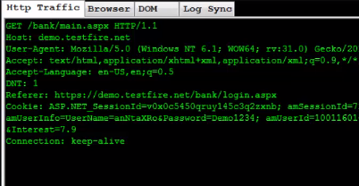

OWASP  - 敏感数据曝光2

各种银行应用程序已禁用屏幕截图功能，因为它可能包含敏感数据。

对策
+ 加密传输和静止的所有数据。

+ 使用安全协议和算法。

+ 禁用缓存敏感数据的响应。黑客可能会获得缓存副本并从中窃取信息。

4. XML外部实体（XXE）
介绍
“如果应用程序允许用户上传恶意XML，进一步利用易受攻击的代码和/或依赖项，则该应用程序容易受到XXE攻击。”

这可用于执行代码，窃取数据和执行其他恶意任务。  

例

以下网页使用户能够上传XML文件，并将对数据进行处理/解析，并显示在同一页面的下方。用户提交世界并进行处理。

OWASP  -  XML外部实体

如果用户提交类似下面提交的XML的内容，那么解析器将处理该内容，并且响应将发生变化。

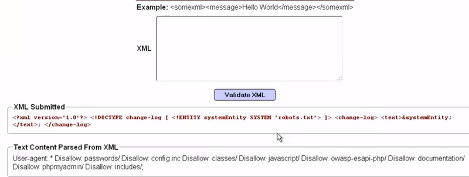

OWASP  -  4. XML外部实体2

从用户请求大数据的各种网站与字段共享EXCEL文件。要求用户填写Excel工作表并运行宏以将文件转换为用户上载的XML文件。之前遵循了这项技术提交印度纳税申报表。在这种情况下，请在解析之前检查上载的XML是否正在被清理或拒绝。

对策
+ 避免敏感数据的序列化

+ 在服务器端实施白名单方法以防止恶意XML上载。

+ 使用WAF检测和阻止XXE。

+ 代码审查 

5.访问控制中断
介绍
“如果用户能够访问未经授权的资源，则会发生访问控制中断，这可以访问受限制的页面，数据库，目录等。”

应用程序具有各种帐户类型，具体取决于用户：管理员，操作员和报告组等。一个常见问题是开发人员仅在UI端而不是在服务器端限制权限。如果被利用，每个用户都可以拥有管理员权限。

例

以下是2个用户“Jsmith和admin用户”的示例。Jsmith无权编辑用户，但管理员拥有该权限。这可以通过每个用户左侧显示的权限进行验证。 

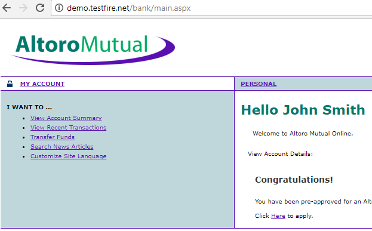

OWASP  - 破碎的访问控制

漏洞是用户jsmith可以直接点击编辑用户页面的URL并编辑用户，即使他不是管理员。 

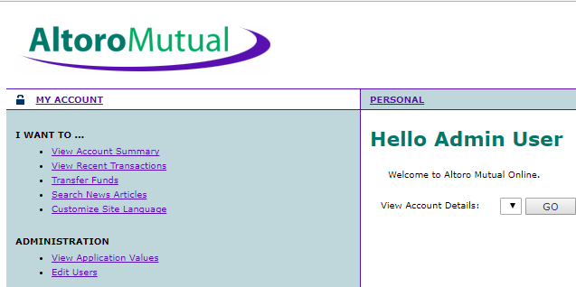

OWASP  - 破碎的访问控制2

对策
+ 注销后无效的令牌和cookie。

+ 密码更改后强制登录/注销。

+ 服务器端资源限制，例如目录。

+ 限制对所有资源基础角色的访问。

6.安全性配置错误
介绍
开发人员和IT人员确保功能而非安全性。配置在应用服务器，数据库服务器，代理，应用程序和其他设备上完成，需要符合安全要求。除非由专家或黑客识别，否则大多数安全要求都会被遗漏。

这些安全性错误配置的示例包括弱密码，默认密码，存储在服务器上的默认脚本，默认目录，默认错误消息等。 

例

目录列表可用

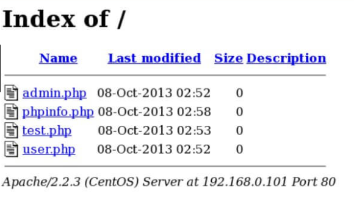

OWASP  - 安全性错误配置

服务器的默认错误消息可以攻击者指纹服务器abd版本并发起有针对性的攻击。
OWASP  - 安全性错误配置2

对策
+ 为硬件和应用程序设置硬化过程。确保更改默认值。

+ 仅从框架安装所需的功能。

+ 以固定间隔检查配置的安全性。

7.跨站点脚本（XSS）
介绍
当攻击者能够将不受信任的数据/脚本插入网页时，就会发生跨站点脚本。攻击者插入的数据/脚本在浏览器中执行可以窃取用户数据，破坏网站等。

XSS有3种类型：

反射的

存储

基于DOM     

例

带有搜索字段的页面：用户输入如下所示的JavaScript，一旦按下搜索，输入脚本就会被处理，弹出窗口将显示在屏幕上。现在可以根据需要更改脚本来窃取数据和破坏网站。这是反映的XSS的示例。

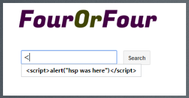

OWASP  - 跨站点脚本（XSS）OWASP  - 跨站点脚本（XSS）

以下是存储的XSS的示例 - 网页具有注释字段，并且存储和显示用户的注释。用户可以在注释字段中输入恶意脚本，每次加载页面时脚本都将被执行。

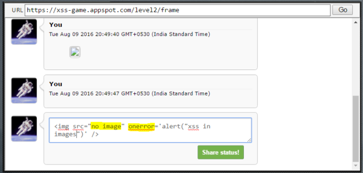

OWASP  - 跨站点脚本（XSS）2

对策
+ 输出编码和转义不受信任的字符。

+ 启用内容安全策略（CSP）

8.不安全的反序列化
介绍
一些应用程序在客户端保存数据，他们可能正在使用对象序列化。依赖于客户端维护状态的应用程序可能允许篡改序列化数据。这是列表中的新条目，很难利用。 

例

更改cookie中的序列化对象以进行权限提升。

X：x：{z：z：“NAME”：r：“USER”} - >>正常cookie 
X：x：{z：z：“NAME”：r：“ADMIN”} - >>更改cookie宾语

对策
+ 加密序列化数据。

+ 反序列化器以最少的权限运行

9.使用具有已知漏洞的组件
介绍
如果应用程序使用任何具有已知漏洞的组件，则可能导致安全漏洞或服务器接管。组件可以是编码框架，库，易受攻击的功能，网络框架等。

例

使用易受攻击的PHP版本

过时的内核版本 - Linux

未修补的窗口。 

易受攻击的jQuery版本

获取使用的jQuery版本

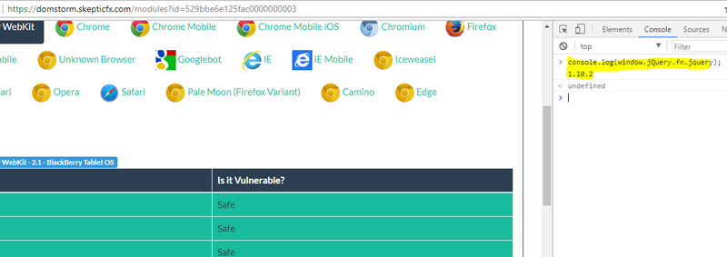

OWASP  - 使用具有已知漏洞的组件

OWASP  - 使用已知漏洞的组件2

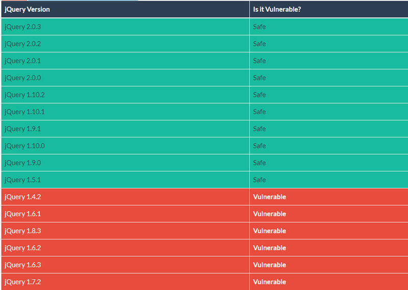

参考：https：//domstorm.skepticfx.com/modules？id = 529bbe6e125fac0000000003

对策
+ 频繁的修补过程。

+ 订阅各种论坛，分享最新的漏洞以及CVE编号和缓解技术/修复。检查漏洞是否会影响清单中的设备/软件并进行修复。

10.记录和监控不足
介绍
有了所有针对性的对策，攻击仍然会发生，只有在事件发生后才会引起注意。如果未被发现，攻击者可能会长时间地破坏系统并获得持久性。 
为了确保预先发现攻击者的恶意意图，必须记录所有活动并监视其是否存在任何可疑行为。  

例

来自特定源的登录尝试失败次数过多。

来自特定源的极快/慢/固定速率的太多请求可能是DOS尝试。做检查并采取行动。

垃圾流量

不期望的交通模式激增。

OWASP  - 记录和监控不足

对策
+ 全天候监控应用流量和日志分析。

+ 有效的安全事件和响应程序到位和实践。 

结论
OWASP排名前10位的漏洞可作为基准测试，并帮助管理层以更准确的方式识别漏洞的严重性。这些以及一些其他检查点可用于为组织的应用程序安全性测试开发基准。很少有其他检查可以：

点击劫持
缓冲区溢出
不安全的API
下面是2013年与2017年前十大漏洞的比较。请检查所有这些漏洞，因为其中一些漏洞可能已经下降但仍然存在。

比较2013年与2017年的十大漏洞

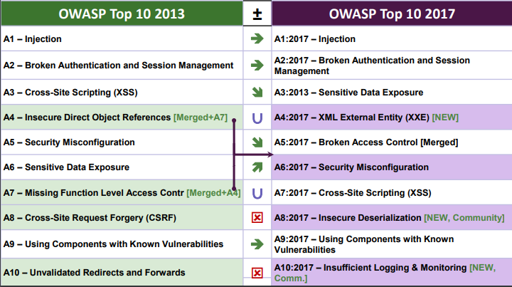

参考：https：//www.owasp.org/